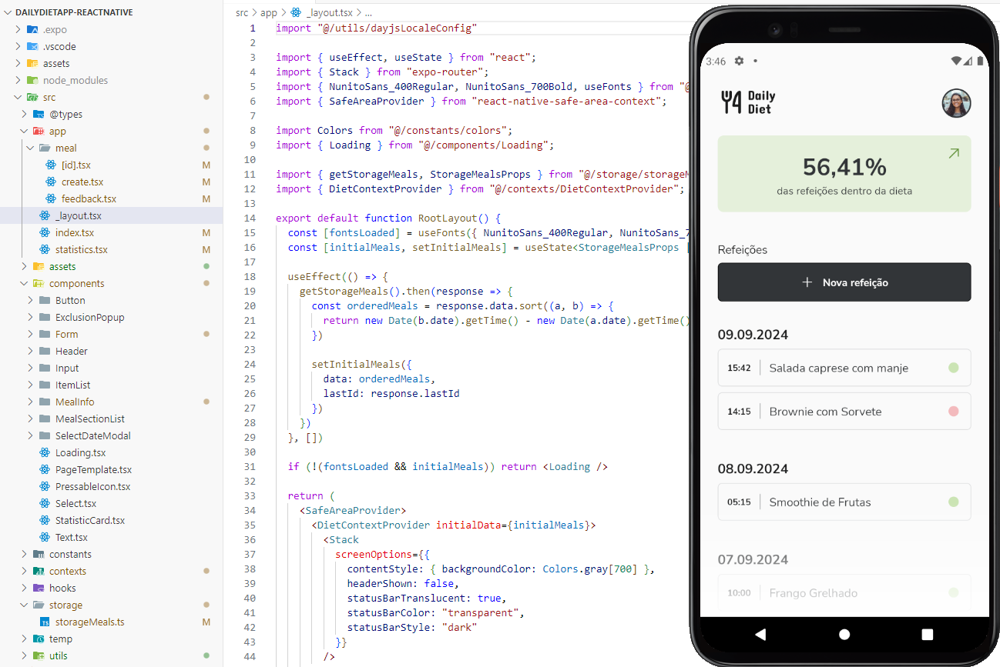

# Daily Diet App

The Daily Diet App is a project developed as part of the Rocketseat React Native training challenge, with the goal of practicing mobile development skills. The app allows for meal tracking and monitoring whether they are within or outside of a diet, serving as a practical tool for those who want to keep track of their nutrition.

In this challenge, besides implementing the functionalities, the focus is on applying good mobile development practices, such as screen navigation, local storage, and interactive animations.

## Features

- Add a new meal.
- Edit an existing meal.
- Remove a meal from the list.
- Display diet progress statistics, such as:
  - Total number of recorded meals.
  - Number of meals within and outside the diet.
  - Percentage of meals within the diet.
  - Best streak of meals within the diet.
- Screen navigation using a stack.
- Local storage of meals.

## Demo

## Technologies Used

- **Navigation**: Expo Router
- **Styling**: 
  - React Native's `StyleSheet`.
  - expo-blur for blur effects.
  - expo-linear-gradient for linear gradients.
- **Animations**: Reanimated
- **Storage**: AsyncStorage

## Folder Structure
- src/
  - app/ - Contains the main pages of the application.
  - components/ - Reusable components such as buttons, inputs, and modals.
  - contexts/ - Global context for managing meal state.
  - hooks/ - Custom hooks.
  - storage/ - AsyncStorage manipulation functions.
  - utils/ - Utilities such as date formatting and locale settings.